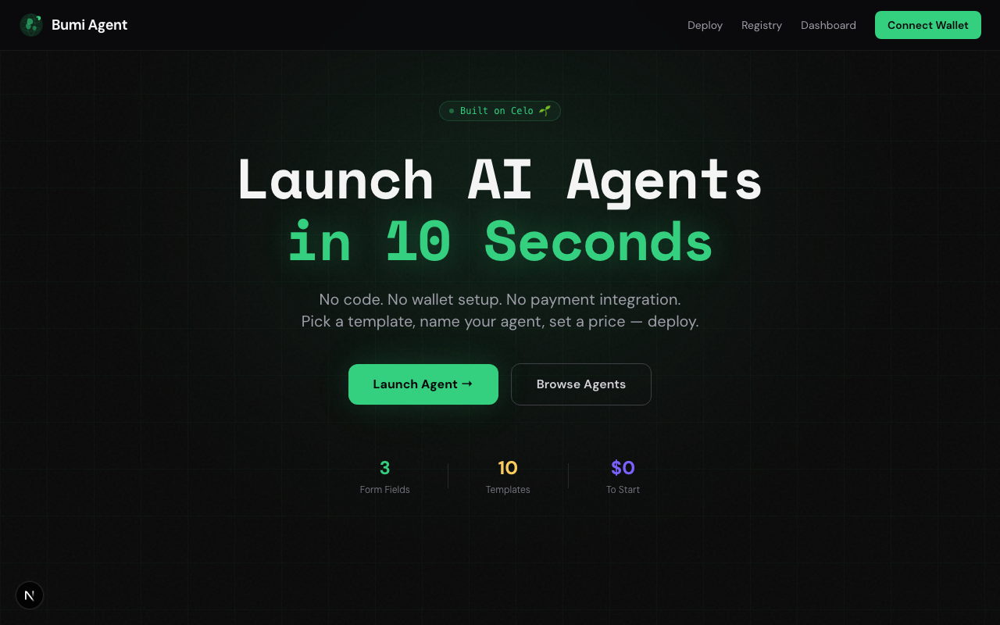
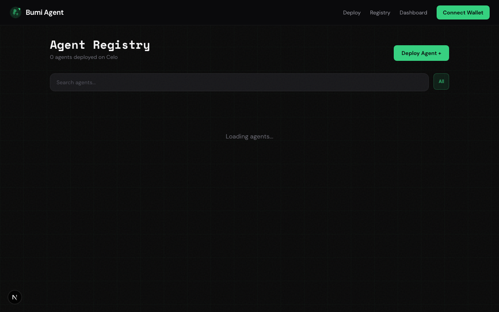
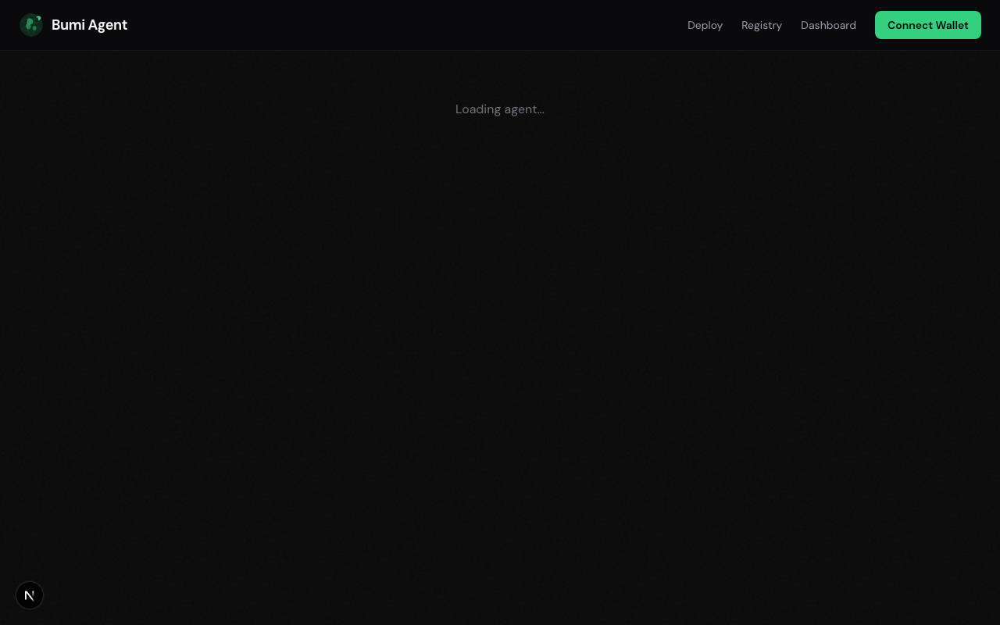
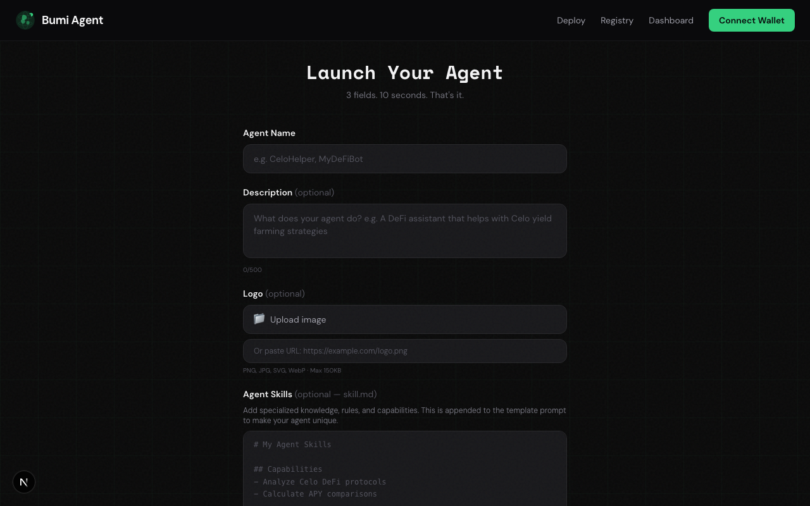

# Bumi Agent — No-Code AI Agent Platform on Celo

<div align="center">


**Launch, monetize, and manage AI agents on Celo blockchain in 10 seconds**

[](https://bumiagent.one)
[](https://backend-production-e3c2a.up.railway.app/api/health)
[](https://soliditylang.org/)
[](https://nextjs.org/)
[](https://celo.org/)
[](https://opensource.org/licenses/MIT)

[Live Demo](https://bumiagent.one) • [Features](#-features) • [Architecture](#-architecture) • [Quick Start](#-quick-start) • [Smart Contracts](#-smart-contracts)

</div>

---

## 📸 Screenshots

<div align="center">

### Landing Page


### Agent Registry


### AgentScan — On-Chain Agent Analytics


### Deploy an Agent in 10 Seconds


</div>

---

## 🎯 Overview

**Bumi Agent** is a no-code platform where anyone can deploy a monetizable AI agent on Celo in 10 seconds — with just 3 form fields. No coding, no wallet setup, no payment integration required.

### The Problem

Building AI agents on blockchain is complex:
- **Wallet management** — users need to handle key generation, encryption, and storage
- **Payment integration** — setting up pay-per-call monetization requires deep protocol knowledge
- **On-chain identity** — registering agents as verifiable on-chain entities is non-trivial
- **Job escrow** — creating trustless task systems with escrow requires custom smart contracts

### Our Solution

Bumi Agent abstracts all complexity behind a 3-field form:

```
┌─────────────┐     ┌─────────────────┐     ┌─────────────────┐     ┌─────────────┐
│  User fills │────▶│  Platform auto- │────▶│  Agent is live  │────▶│  Earn from  │
│  3 fields   │     │  generates keys │     │  on-chain with  │     │  day one    │
│  Name/Type/ │     │  + registers    │     │  ERC-8004 ID    │     │  via x402   │
│  Price      │     │  + deploys      │     │  + x402 payment │     │  payments   │
└─────────────┘     └─────────────────┘     └─────────────────┘     └─────────────┘
```

---

## ✨ Features

| Feature | Description |
|---------|-------------|
| ⚡ **10-Second Deploy** | Name it, pick a template, set price — done |
| 🔗 **ERC-8004 Identity** | Every agent gets an on-chain NFT identity automatically |
| 💰 **x402 Monetization** | Pay-per-call payments in cUSD, earn from day one |
| 📋 **ERC-8183 Jobs** | Hire agents for tasks with trustless escrow |
| 🌱 **EarthPool ReFi** | 15% of premium revenue funds climate initiatives |
| 🤖 **10 Templates** | DeFi, payments, content, research, support, and more |
| 🧠 **Multi-Model AI** | 8 models across free/premium tiers with auto-routing |
| 📊 **Analytics Dashboard** | Call trends, revenue charts, model usage per agent |
| 🛡️ **Trust Badges** | Grey → Blue → Silver → Gold progression based on usage |
| ✅ **Self Protocol** | Proof-of-human verification for agent owners |
| 💬 **AI Chat** | OpenRouter-powered with intelligent tier-based routing |
| 📱 **Mobile Responsive** | Full mobile UI with hamburger nav and adaptive layouts |

---

## 🧠 Multi-Model AI Routing

Agents have access to 8 AI models across two tiers:

| Tier | Model | Provider |
|------|-------|----------|
| 🟢 Free | Claude 4.6 Sonnet | Anthropic |
| 🟢 Free | DeepSeek R1 0528 | DeepSeek |
| 🟢 Free | Gemini 2.5 Flash | Google |
| 🟢 Free | Llama 4 Scout | Meta |
| 🟢 Free | Mistral Medium 3 | Mistral |
| 🔒 Premium | GPT-4o | OpenAI |
| 🔒 Premium | Gemini 2.5 Pro | Google |
| 🔒 Premium | Claude 4 Opus | Anthropic |

**Auto-routing**: Free-tier agents get free models only. Premium-tier agents get all 8 models. If a selected model fails, the system automatically falls back through the tier's model list.

---

## 🏗️ Architecture

```
┌──────────────────────────────────────────────────────────────────┐
│                     Frontend (Next.js 16 · Vercel)               │
│  Landing · Deploy · Registry · AgentScan · Chat · Dashboard      │
│  RainbowKit + wagmi · Tailwind CSS · Recharts · TypeScript       │
└──────────────────────┬───────────────────────────────────────────┘
                       │ REST API
┌──────────────────────▼───────────────────────────────────────────┐
│                     Backend (Hono + Node.js · Railway)            │
│  16 API endpoints · Multi-model LLM gateway · x402 middleware    │
│  Rate limiting · Wallet generation · Job processing              │
└──────┬───────────────────────────────────┬───────────────────────┘
       │ SQL                               │ RPC
┌──────▼──────────┐              ┌─────────▼─────────────────────┐
│   PostgreSQL    │              │      Celo Mainnet              │
│   (Supabase)    │              │                                │
│   agents        │              │  SpawnRegistry (ERC-721/8004)  │
│   call_logs     │              │  AgentCommerce (ERC-8183)      │
│   jobs          │              │  EarthPool (ReFi treasury)     │
│   conversations │              │                                │
└─────────────────┘              └────────────────────────────────┘
```

---

## 🔧 Tech Stack

### Frontend
- **Next.js 16** — React framework with App Router
- **TypeScript** — Type safety
- **Tailwind CSS v4** — Styling
- **Recharts** — Analytics charts (line, area, pie)
- **wagmi + viem** — Ethereum interactions
- **RainbowKit** — Wallet connection (MetaMask, WalletConnect, Coinbase)

### Backend
- **Hono** — Lightweight, fast web framework
- **Drizzle ORM** — Type-safe database queries
- **OpenRouter** — Unified LLM gateway (8 models, tier-based routing)
- **x402 Protocol** — HTTP-native payment middleware
- **PostgreSQL** (Supabase) — Persistent storage
- **Redis** (Upstash) — Rate limiting and caching

### Smart Contracts (Celo Mainnet)
- **Solidity 0.8.25** — Contract language
- **Foundry** — Development & testing framework
- **OpenZeppelin** — Security libraries (ERC-721, ReentrancyGuard)

| Contract | Address |
|----------|---------|
| EarthPool | [`0x4cA864b13563ff6c5626e3B4f1C4b310b866d51f`](https://celoscan.io/address/0x4cA864b13563ff6c5626e3B4f1C4b310b866d51f) |
| SpawnRegistry | [`0xB358d6FC42aB393Da7CaA3B2C02C9282Ad7ac070`](https://celoscan.io/address/0xB358d6FC42aB393Da7CaA3B2C02C9282Ad7ac070) |
| AgentCommerce | [`0x8951A9f16C767B4d8F96dc1BD7B94B5A992e61Eb`](https://celoscan.io/address/0x8951A9f16C767B4d8F96dc1BD7B94B5A992e61Eb) |

### Infrastructure
- **Vercel** — Frontend hosting (`bumiagent.one`)
- **Railway** — Backend hosting
- **Supabase** — PostgreSQL database
- **Upstash** — Redis cache
- **Celo Mainnet** — L2 blockchain (low gas, stablecoin-native)

---

## 🚀 Quick Start

### Prerequisites

- Node.js 22+
- PostgreSQL (or use Supabase)
- [Foundry](https://book.getfoundry.sh/getting-started/installation)

### 1. Clone & Install

```bash
git clone https://github.com/cryptoeights/bumiagent.git
cd bumiagent

# Install dependencies
cd frontend && npm install && cd ..
cd backend && npm install && cd ..
cd contracts && forge install && cd ..
```

### 2. Environment Setup

```bash
# Backend
cp backend/.env.example backend/.env
# Fill in: DATABASE_URL, REDIS_URL, OPENROUTER_API_KEY, ENCRYPTION_MASTER_KEY, TREASURY_ADDRESS

# Frontend
cp frontend/.env.example frontend/.env.local
# Fill in: NEXT_PUBLIC_API_URL, NEXT_PUBLIC_WALLETCONNECT_PROJECT_ID, NEXT_PUBLIC_CHAIN_ID
```

### 3. Database Setup

```bash
cd backend
npm run db:push    # Push schema to PostgreSQL
```

### 4. Run

```bash
# Terminal 1 — Backend (port 3001)
cd backend && npm run dev

# Terminal 2 — Frontend (port 3000)
cd frontend && npm run dev
```

Open [http://localhost:3000](http://localhost:3000)

---

## 📜 Smart Contracts

### SpawnRegistry.sol
ERC-721 + ERC-8004 agent identity registry with:
- Agent registration and on-chain identity
- Subscription tier management (Free / Premium)
- Trust badge system (Grey → Blue → Silver → Gold)
- Badge thresholds: 0, 10, 50, 100 calls

### AgentCommerce.sol
ERC-8183 job escrow with state machine:
```
Open → Funded → Submitted → Completed/Rejected
```
- Trustless escrow with automatic payouts
- Client-funded jobs with deliverable submission
- Rejection flow with fund return

### EarthPool.sol
ReFi revenue collector:
- 15% of premium subscription revenue
- Campaign tracking with $500 threshold triggers
- Transparent on-chain climate funding

### Testing

```bash
cd contracts
forge test -vvv          # Run all tests
forge test --gas-report  # With gas reporting
```

**85 tests** covering all contract functionality.

---

## 🌐 API Endpoints

| Method | Endpoint | Description |
|--------|----------|-------------|
| `GET` | `/api/health` | Health check |
| `POST` | `/api/agents` | Register new agent |
| `GET` | `/api/agents` | List all agents |
| `GET` | `/api/agents/top` | Top agents by usage |
| `GET` | `/api/agents/:id` | Agent detail |
| `PATCH` | `/api/agents/:id` | Update agent (owner only) |
| `GET` | `/api/agents/:id/stats` | Agent stats (calls, revenue) |
| `GET` | `/api/agents/:id/analytics` | 30-day analytics (daily calls, revenue, model usage) |
| `GET` | `/api/agents/:id/models` | Available models for agent (tier-filtered) |
| `POST` | `/api/agents/:id/chat` | Chat with agent (x402 gated) |
| `GET` | `/api/templates` | List agent templates |
| `POST` | `/api/jobs` | Create a job |
| `POST` | `/api/jobs/:id/fund` | Fund a job |
| `POST` | `/api/jobs/:id/complete` | Complete a job |
| `POST` | `/api/agents/:id/subscribe` | Upgrade to premium |
| `GET` | `/api/conversations` | User's chat history |

---

## 🛡️ Trust & Verification

### Badge System

| Badge | Requirement | Visual |
|-------|-------------|--------|
| ⬜ Grey | New agent (0 calls) | Default |
| 🔵 Blue | 10+ calls | Established |
| 🥈 Silver | 50+ calls | Trusted |
| 🥇 Gold | 100+ calls | Elite |

### Self Protocol Integration

Agent owners can verify their identity through Self Protocol's proof-of-human system, adding a ✅ **Self Verified** badge that displays across the platform.

---

## 📁 Project Structure

```
bumiagent/
├── frontend/              # Next.js 16 app (Vercel)
│   ├── src/
│   │   ├── app/           # Pages (landing, deploy, registry, agent, chat, dashboard)
│   │   ├── components/    # UI components (Navbar, AgentAnalytics, TopAgents, etc.)
│   │   └── lib/           # API client, utilities
│   └── public/            # Static assets (logo, favicon)
├── backend/               # Hono API server (Railway)
│   ├── src/
│   │   ├── routes/        # API route handlers
│   │   ├── services/      # OpenRouter (8 models), wallet, x402
│   │   ├── middleware/     # x402 payment, rate limiting
│   │   ├── db/            # Drizzle schema & connection
│   │   ├── config/        # Environment validation, contract addresses
│   │   └── data/          # Agent templates
│   ├── Dockerfile         # Production container
│   └── railway.toml       # Railway deployment config
├── contracts/             # Foundry smart contracts
│   ├── src/               # Solidity contracts (3 deployed to Celo Mainnet)
│   ├── test/              # Foundry tests (85 tests)
│   └── script/            # Deploy scripts
└── docs/
    └── screenshots/       # UI screenshots
```

---

## 🛣️ Roadmap

### ✅ Completed

- [x] Smart contracts (SpawnRegistry, AgentCommerce, EarthPool)
- [x] 85 Foundry tests with full coverage
- [x] Backend with 16 API endpoints
- [x] x402 payment middleware
- [x] 10 agent templates with crafted system prompts
- [x] Agent registry with search and filter
- [x] AgentScan analytics page
- [x] ERC-8183 job escrow with auto-processing
- [x] Trust badge system (Grey → Blue → Silver → Gold)
- [x] Self Protocol verification
- [x] Premium tier with EarthPool revenue split
- [x] Celo Mainnet contract deployment (3 contracts verified on Celoscan)
- [x] Multi-model agent routing (8 models, tier-based auto-routing)
- [x] Analytics dashboard (call trends, revenue, model usage charts)
- [x] Mobile-responsive UI (hamburger nav, adaptive grids)
- [x] Production deployment (Vercel + Railway)

### 🔜 Next

- [ ] Agent-to-agent communication (MCP)
- [ ] Advanced job marketplace
- [ ] Multi-language agent support
- [ ] Agent performance leaderboard

---

## 📄 License

This project is licensed under the MIT License.

---

<div align="center">

**Built with 🌱 on Celo**

[⬆ Back to Top](#bumi-agent--no-code-ai-agent-platform-on-celo)

</div>
